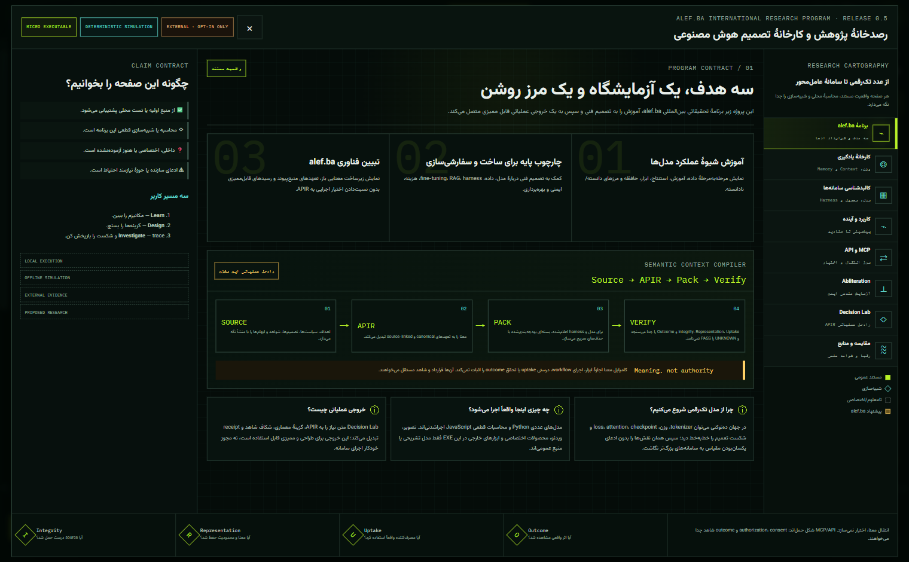
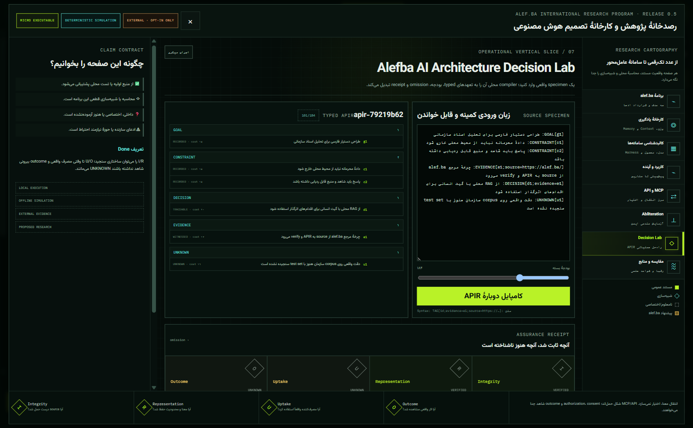

# Alefba AI Model Lab

An offline-first, source-backed, interactive laboratory for learning how AI systems work, making architecture decisions, and investigating their behavior at a scale small enough to inspect.

**[نسخهٔ فارسی](README.fa.md)** · [Getting started](docs/GETTING_STARTED.md) · [Architecture](docs/ARCHITECTURE.md) · [Research sources](docs/research/SOURCES.md)

> [!IMPORTANT]
> This project is an educational laboratory, not a replica of proprietary systems. It does not claim access to private weights, training data, hidden chain-of-thought, or confidential architectures. Product names are used only for source-backed comparison. Simulated scenarios are explanatory models, not forecasts or evidence about a vendor's implementation.

## Why this project exists

Alefba AI Model Lab is developed within the international [**alef.ba research program**](https://alef.ba) around three objectives:

1. **Teach model operation** — make tokens, embeddings, attention, training, sampling, reasoning effort, MoE routing, retrieval, tool use, diffusion, agents, and multimodal pipelines observable.
2. **Support technical decisions** — provide a base for choosing, building, adapting, evaluating, or operating a model without hiding assumptions behind a single benchmark score.
3. **Explain and test alef.ba** — model a bounded semantic pipeline from evidence-bearing sources to a typed intermediate representation, target-aware rendering, and explicit verification receipts.

The lab deliberately combines real micro-models with deterministic simulations. A learner can see where values came from, change one control, replay the same run, and distinguish computation from explanation.

## Three paths through the lab

| Path | Start here | What you can answer |
|---|---|---|
| **Learn** | Ten-token Digit LM, Learning Forge, sampling controls | How does a model turn input into logits and choose the next token? What changes when temperature, top-k, top-p, or penalties move? |
| **Design** | Architecture decision canvases, alef.ba Decision Lab | Which model family, context strategy, retrieval layer, runtime, and verification boundary fit a stated goal and budget? |
| **Investigate** | Research Observatory, deterministic traces, receipts | Which part is measured, simulated, externally reported, or still unknown? Can the result be replayed and sourced? |

## Capability status is part of the interface

Every public capability should carry one of these labels. The label describes evidence, not ambition.

| Label | Meaning in this repository | Examples at this revision |
|---|---|---|
| **Implemented** | Executable locally and backed by repository tests or inspectable output | Ten-token Transformer; n-gram, MLP, dense Transformer, scratchpad, sparse-MoE, SQLite FTS5 RAG, allowlisted tools; desktop research simulation; bounded alef.ba specimen compiler |
| **Simulated** | An explicit educational model of a process; not the named production system | 3D architecture views, agent/reasoning workflows, diffusion and multimodal timelines, scenario and foresight canvases, abliteration visualization |
| **External** | Described from an official paper, documentation, or upstream repository; not executed here | Named commercial systems, public model families, MCP/API/A2A integrations, live provider inference |
| **Planned** | A published direction with no present implementation claim | Portable replay bundles, measured accessibility conformance, signed receipts, target-specific alef.ba renderers, opt-in live adapters |

See the normative [Claim Contract](docs/CLAIM_CONTRACT.md) before describing a feature or comparison.

## Architecture at a glance

~~~mermaid
flowchart LR
    S[Source + provenance] --> A[Typed, source-grounded APIR]
    A --> B[Budget + target profile]
    B --> R[Render]
    R --> V[Verify I / R / U / O]
    V --> D[Decision + receipt]

    A -. payload .-> T[HTTP / API / MCP / A2A]
    T --> ID[Identity]
    ID --> P[Policy + consent]
    P --> X[Authorized execution]
    X --> W[External witnesses for U / O]
    W --> V
~~~

The alef.ba lane is intentionally narrow:

**source → typed/source-grounded APIR → budget/target profile → render → verify/receipt**

- **I — Integrity:** is the artifact structurally valid and internally consistent?
- **R — Representation:** can its commitments be traced to source and provenance?
- **U — Uptake:** did the intended recipient or model actually receive/use it? This remains `UNKNOWN` without an external witness.
- **O — Outcome:** did the claimed real-world outcome occur? This remains `UNKNOWN` without an external witness.

APIR is an intermediate meaning representation. It can be carried by a protocol, but **transport ≠ authority**: HTTP, an API, MCP, A2A, or JSON-RPC does not by itself grant identity, consent, policy approval, or permission to execute. Read the full [architecture](docs/ARCHITECTURE.md) and [Decision Lab contract](docs/ALEFBA_DECISION_LAB.md).

## What is in the monorepo

~~~text
Sample01/
├── src/digit_lm/                  # real ten-token decoder-only Transformer
├── tests/                         # Digit LM behavioral and safety tests
├── reasoning-lab/
│   ├── src/reasoning_lab/         # transparent model, RAG, tool, and trace engines
│   ├── tests/                     # reasoning-lab tests
│   └── desktop/                   # Electron + Vite + Three.js visual laboratory
├── docs/                          # architecture, evidence, comparison, and research docs
├── data/                          # small, inspectable local datasets
├── configs/                       # reproducible experiment configuration
└── artifacts/                     # generated local checkpoints and reports
~~~

The repository has three deliberately different execution surfaces:

- **Digit Microscope LM — real computation.** A CPU-friendly decoder-only Transformer whose vocabulary is exactly `0…9`. It trains on the next-digit task, exposes tensors and probabilities, and makes out-of-distribution behavior inspectable.
- **Micro Reasoning Lab — real, bounded components.** Small n-gram, MLP, dense Transformer, scratchpad, sparse-MoE, RAG, and allowlisted-tool experiments with SQLite-backed traces.
- **Desktop Visual Lab — deterministic explanation and comparison.** Electron/Vite/Three.js projections turn state into interactive diagrams. Where the upstream production system is unavailable, the UI says `Simulated` or `External` rather than implying execution.

## Quick start

### 1. Run the ten-token language model

Requires Python 3.11 and [uv](https://docs.astral.sh/uv/).

~~~powershell
uv sync --frozen
uv run digit-lm run-lab --reset
uv run digit-lm predict 4 --no-trace
uv run digit-lm serve
~~~

The local service exposes the training and inference laboratory. No API key is required.

### 2. Run the reasoning laboratory

~~~powershell
Set-Location reasoning-lab
uv sync --frozen
uv run reasoning-lab build-data
uv run reasoning-lab train-all
uv run reasoning-lab verify
uv run reasoning-lab serve
~~~

The five checkpoints are reproducible build outputs and are intentionally not
stored in Git. A clean clone must run the three preparation commands above;
the synthetic curriculum and its provenance are documented in the
[Reasoning Lab Data Card](reasoning-lab/docs/fa/DATA_CARD.md).

### 3. Run or package the desktop laboratory

Requires Node.js `^20.19.0` or `>=22.12.0`.

~~~powershell
Set-Location reasoning-lab/desktop
npm ci
npm run check
npm run dev
~~~

Build the Windows x64 portable executable locally with:

~~~powershell
npm run dist:win
~~~

Published and checksum-bearing Windows artifacts, when available, belong on the repository's [Releases page](https://github.com/danialsamiei/alefba-ai-model-lab/releases). A source checkout or successful local build is not itself a published release.

For expected output, test commands, and troubleshooting, use the full [Getting Started guide](docs/GETTING_STARTED.md).

## Research and comparison discipline

The project compares educational and visualization tools with a neutral rubric covering breadth, interactivity, offline use, 3D, deterministic replay, scientific sourcing, Windows packaging, and accessibility. `ND` means “not documented,” not “absent.” See the dated [comparison matrix](docs/COMPARISON.md) and the [primary-source register](docs/research/SOURCES.md).

Named systems—including ChatGPT, Sora, Codex, Claude Code, Qwen, DeepSeek, diffusion models, video/audio/code generators, agent harnesses, MCP servers, and projects such as MiroFish—are described only to the depth supported by public primary sources. The lab does not infer private implementation details from product behavior.

## Documentation map

- [Getting Started](docs/GETTING_STARTED.md) — prerequisites, three runnable tracks, verification, and Windows packaging
- [Architecture](docs/ARCHITECTURE.md) — trust boundaries, computation surfaces, and semantic lane
- [alef.ba Decision Lab](docs/ALEFBA_DECISION_LAB.md) — inputs, APIR, budgets, render targets, and receipts
- [Claim Contract](docs/CLAIM_CONTRACT.md) — required evidence and public wording rules
- [Replay Specification](docs/REPLAY_SPEC.md) — deterministic events, canonicalization, redaction, and conformance
- [Threat Model](docs/THREAT_MODEL.md) — assets, threats, current controls, and planned controls
- [Comparison](docs/COMPARISON.md) — dated, source-linked competitor matrix
- [Research Sources](docs/research/SOURCES.md) — primary papers, standards, official documentation, and upstream repositories
- [Reasoning Lab Data Card](reasoning-lab/docs/fa/DATA_CARD.md) — synthetic-data scope, generator provenance, hashes, intended uses, and exclusions
- [Roadmap](ROADMAP.md), [Governance](GOVERNANCE.md), [Contributing](CONTRIBUTING.md), and [Security](SECURITY.md)

## Contributing and citation

Issues and contributions that improve factual accuracy, Persian accessibility, deterministic tests, or small inspectable experiments are welcome. Please read [CONTRIBUTING.md](CONTRIBUTING.md) and the [Code of Conduct](CODE_OF_CONDUCT.md). Security-sensitive reports follow [SECURITY.md](SECURITY.md).

Citation metadata is provided in [CITATION.cff](CITATION.cff). Source code is licensed under the [MIT License](LICENSE); datasets, model artifacts, papers, screenshots, and trademarks may carry their own terms and must be checked independently.

Visual-asset generation and screenshot provenance are recorded in [docs/assets/ASSET_PROVENANCE.md](docs/assets/ASSET_PROVENANCE.md).
