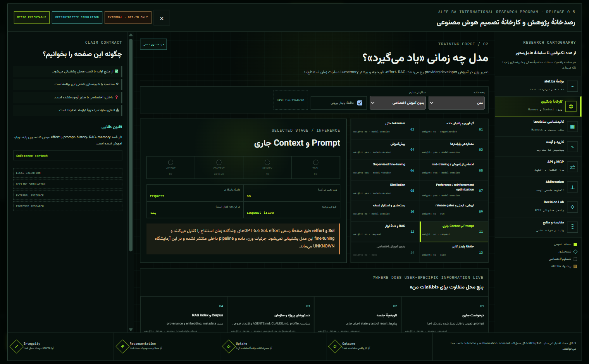

# Getting Started

Revision date: **2026-08-31**

Alefba AI Model Lab has three local tracks. Start with the ten-token model if you want to understand every tensor, use the reasoning lab to compare architectures and inference systems, and open the desktop lab for interactive 2D/3D explanations.

The core tracks do not require an API key.

## 1. Prerequisites

### Required for the Python labs

- Windows 10/11, Linux, or macOS;
- Python **3.11.x** (the packages currently require `>=3.11,<3.12`);
- [uv](https://docs.astral.sh/uv/) for locked dependency installation;
- enough disk space for CPU PyTorch and generated local artifacts.

The repository's current `.python-version` targets Python 3.11.9.

### Required for the desktop lab

- Node.js **`^20.19.0` or `>=22.12.0`** (required by the current Vite toolchain);
- npm bundled with Node.js;
- a GPU is helpful for smooth 3D rendering but not required for the Python micro-models;
- Windows x64 if you want to build the current portable `.exe` target.

### Check your environment in PowerShell

~~~powershell
python --version
uv --version
node --version
npm --version
~~~

If only the Python tracks matter, Node.js is optional. If only the desktop visual simulator matters, Python is not required for its current static research views.

## 2. Obtain and enter the repository

~~~powershell
git clone https://github.com/danialsamiei/alefba-ai-model-lab.git
Set-Location alefba-ai-model-lab
~~~

If you already have a source archive or checkout, enter its root—the folder containing the root `pyproject.toml` and `reasoning-lab/`.

## 3. Track A — Digit Microscope LM

This is the smallest real model in the repository: a decoder-only Transformer whose entire vocabulary is the ten digits `0…9`.

### 3.1 Install exact locked dependencies

~~~powershell
uv sync --frozen
~~~

### 3.2 Build data, pretrain, fine-tune, and evaluate

~~~powershell
uv run digit-lm run-lab --reset
~~~

The command creates/refreshes the local curriculum, SQLite experiment ledger, checkpoints, metrics, and a laboratory report. Training time depends on CPU and configuration. Generated artifacts are local evidence, not a published model release.

For a shorter development-only pass:

~~~powershell
uv run digit-lm run-lab --reset --quick
~~~

`--quick` is intentionally described by the CLI as non-deliverable; do not use it as acceptance evidence.

### 3.3 Predict the next digit

~~~powershell
uv run digit-lm predict 4 --no-trace
~~~

Expected semantic result for the canonical trained task: the model should prefer `5`. The command prints JSON with the selected next token and probability information. Exact probabilities depend on the checkpoint; do not hard-code them as universal results.

To inspect the full trace:

~~~powershell
uv run digit-lm predict 4 --trace
uv run digit-lm inspect 34 --trace
~~~

The first input is within the intended single-digit interface. The multi-digit `inspect` command is useful for exploring how the model behaves outside or beyond its simplest training presentation. It does not create a guarantee about arbitrary unseen data.

### 3.4 Open the local web laboratory

~~~powershell
uv run digit-lm serve --host 127.0.0.1 --port 8000
~~~

Open [http://127.0.0.1:8000](http://127.0.0.1:8000). A health check is available at [http://127.0.0.1:8000/healthz](http://127.0.0.1:8000/healthz).

Keep the host bound to `127.0.0.1` unless you have deliberately reviewed network exposure. Stop the service with `Ctrl+C`.

## 4. Track B — Micro Reasoning Lab

This Python package compares bounded n-gram, MLP, dense Transformer, scratchpad, sparse-MoE, retrieval, and allowlisted-tool paths.

### 4.1 Install

~~~powershell
Set-Location reasoning-lab
uv sync --frozen
~~~

### 4.2 Build and train

~~~powershell
uv run reasoning-lab build-data
uv run reasoning-lab train-all
uv run reasoning-lab evaluate
uv run reasoning-lab verify
~~~

Useful inspection commands:

~~~powershell
uv run reasoning-lab status
uv run reasoning-lab solve "ADD(A,B)" --facts "A=3,B=5" --model dense_scratch --mode model_only --effort low
uv run reasoning-lab solve "MUL(ADD(A,B),C)" --facts "A=3,B=5,C=2" --model moe_scratch --mode rag --effort medium
~~~

The profiles and modes are micro-experiments. `effort` changes the bounded local inference policy; it is not an emulation of a vendor's private “deep think” implementation.

### 4.3 Start its web interface

~~~powershell
uv run reasoning-lab serve --host 127.0.0.1 --port 8001
~~~

Open [http://127.0.0.1:8001](http://127.0.0.1:8001). Health and readiness endpoints are:

- [http://127.0.0.1:8001/api/health](http://127.0.0.1:8001/api/health)
- [http://127.0.0.1:8001/api/ready](http://127.0.0.1:8001/api/ready)

Port `8001` avoids conflict if the Digit LM service is still running on `8000`.

## 5. Track C — Desktop Visual Lab

The desktop application renders source-backed educational state using Electron, Vite, and Three.js. It includes the Learning Forge, Research Observatory, and alef.ba Decision Lab.

From the repository root:

~~~powershell
Set-Location reasoning-lab/desktop
npm ci
npm run check
npm run dev
~~~

`npm run check` runs the Node test suite and builds the web bundle. `npm run dev` builds the bundle and opens Electron.

What to look for:

1. status badges separating `Implemented`, `Simulated`, `External`, and `Planned`;
2. input → transformation → output flows;
3. source and documentation links in concept panels;
4. deterministic changes when the same specimen and controls are replayed;
5. U/O values remaining unknown without an external witness;
6. 3D geometry acting as a projection of state rather than hidden model telemetry.

## 6. Build the Windows x64 portable executable

From `reasoning-lab/desktop`:

~~~powershell
npm run dist:win
~~~

The configured artifact pattern is:

~~~text
Alefba-AI-Model-Lab-<version>-Windows-<arch>.<ext>
~~~

The build output belongs under `reasoning-lab/desktop/release/`. Verify the produced artifact rather than assuming an older file in that directory corresponds to the current source.

Before describing a binary as publicly released, require all of the following:

1. the artifact is attached to the matching GitHub release;
2. version, revision, and architecture match;
3. the public download hash matches the published SHA-256 value;
4. packaged smoke tests pass on a supported Windows host;
5. release notes identify implemented, simulated, external, and planned capability changes.

Published artifacts, when available, are listed at [GitHub Releases](https://github.com/danialsamiei/alefba-ai-model-lab/releases).

## 7. Verify the source checkout

Run each verification from the correct directory.

### Root Digit LM

~~~powershell
Set-Location <repository-root>
uv run pytest
uv run ruff check .
uv run mypy src
~~~

### Reasoning lab

~~~powershell
Set-Location <repository-root>/reasoning-lab
uv run pytest
uv run ruff check .
uv run mypy src
uv run reasoning-lab verify
~~~

### Desktop lab

~~~powershell
Set-Location <repository-root>/reasoning-lab/desktop
npm run check
~~~

Record the exact command, revision, environment, and result if the output will support a public claim. A command shown in documentation is not itself proof that it passed on a particular revision.

## 8. A suggested learning sequence

| Step | Exercise | Concept |
|---|---|---|
| 1 | Predict `4 → ?` in Digit LM | logits, softmax, argmax/sample |
| 2 | Inspect a multi-digit context | distribution shift and context behavior |
| 3 | Change sampling controls | temperature, truncation, penalties, stopping |
| 4 | Compare n-gram, MLP, and Transformer | capacity, inductive bias, training |
| 5 | Compare scratchpad effort levels | test-time compute versus guarantee |
| 6 | Observe sparse-MoE routing | router, experts, capacity, load balance |
| 7 | Run RAG with provenance visible | retrieval, ranking, context budget, injection risk |
| 8 | Use an allowlisted tool | proposal, validation, authority, execution |
| 9 | Compile an alef.ba specimen | typed APIR, omission ledger, I/R/U/O |
| 10 | Replay and branch a scenario | determinism, counterfactual change, evidence limits |

After every step, ask four questions: What actually executed? What was simulated? Which statement came from an external source? What remains unknown?

## 9. Troubleshooting

### `uv` is not recognized

Install uv using its [official installation guide](https://docs.astral.sh/uv/getting-started/installation/), start a new terminal, and confirm `uv --version`.

### Python version is rejected

Use Python 3.11.x. The current packages intentionally exclude Python 3.12 and later until the locked stack is validated there.

### No checkpoint is found for `predict`

Run `uv run digit-lm run-lab --reset` first, or pass an explicit compatible checkpoint with `--checkpoint`.

### Port 8000 is already in use

Stop the other local service or choose another port:

~~~powershell
uv run digit-lm serve --port 8010
~~~

### Electron opens a blank or stale page

From `reasoning-lab/desktop`, run `npm ci`, then `npm run check`, then `npm run dev`. Treat a build error as the primary evidence; do not work around it by opening an old packaged executable.

### 3D rendering is slow

Close other GPU-heavy applications and update the graphics driver. The explanatory tables and flows should remain the source of semantic meaning; motion or 3D is not required to interpret a claim.

### A result differs across machines

Check revision, lockfiles, configuration, data/checkpoint hash, seed, Python/Node version, dtype, device/backend, and deterministic settings. Read [Replay Specification](REPLAY_SPEC.md) for the evidence needed to call two runs equivalent.

### An external link or product detail has changed

Use the dated [Research Sources](research/SOURCES.md) and [Comparison](COMPARISON.md). Report a stale primary source through GitHub Issues; do not silently strengthen the claim from a secondary summary.

## 10. Reading order

1. [README](../README.md) or [Persian README](../README.fa.md)
2. [Architecture](ARCHITECTURE.md)
3. [alef.ba Decision Lab](ALEFBA_DECISION_LAB.md)
4. [Claim Contract](CLAIM_CONTRACT.md)
5. [Replay Specification](REPLAY_SPEC.md)
6. [Threat Model](THREAT_MODEL.md)
7. [Comparison](COMPARISON.md)
8. [Research Sources](research/SOURCES.md)

For contributions, see [CONTRIBUTING.md](../CONTRIBUTING.md). For sensitive issues, use [SECURITY.md](../SECURITY.md).
