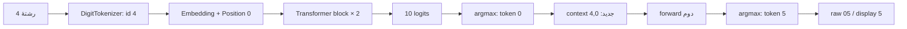

# نقشهٔ مطالعهٔ خط‌به‌خط

هدف این سند این است که کد را مثل یک دستگاه بازشده بخوانید: ابتدا مرز جهان مدل، بعد داده،
سپس forward، آموزش و در پایان inference. پروژه از هیچ مدل، tokenizer یا Trainer آماده‌ای استفاده
نمی‌کند؛ PyTorch فقط tensor، autograd و لایه‌های پایه را فراهم می‌کند.

## قرارداد ثابت دستگاه

- vocabulary دقیقاً `0123456789` و `vocab_size=10` است.
- prompt عمومی دقیقاً یک رقم ASCII است.
- خروجی خام دقیقاً دو توکن است: `0→01` تا `8→09` و `9→10`.
- رابط صفر ابتدایی را فقط هنگام نمایش عدد حذف می‌کند؛ مدل خود `05` را تولید می‌کند.
- هیچ `BOS/EOS/PAD/UNK` وجود ندارد. mask توجه یک tensor بولی است، نه توکن.
- مدل نهایی همهٔ ده mapping را دیده است؛ ۱۰/۱۰ یعنی پوشش کامل تابع محدود، نه تعمیم آماری.
- expectedهای ارزیابی رسمی در probeهای immutable هستند؛ evaluator قانون را در لحظه تولید نمی‌کند.

## مسیر کامل یک درخواست



## ترتیب پیشنهادی فایل‌ها

| مرحله | فایل | پرسشی که پاسخ می‌دهد |
|---:|---|---|
| ۱ | `src/digit_lm/tokenizer.py` | چه چیزی اصلاً قابل نمایش برای مدل است؟ |
| ۲ | `src/digit_lm/data.py` | هر نمونه چطور ساخته و hash می‌شود؟ |
| ۳ | `src/digit_lm/db/schema.sql` | provenance، run و metric کجا ثبت می‌شوند؟ |
| ۴ | `src/digit_lm/attention.py` | `QKᵀ/√d` و causal mask دقیقاً کجا هستند؟ |
| ۵ | `src/digit_lm/model.py` | embedding، residual، MLP و logits چگونه وصل‌اند؟ |
| ۶ | `src/digit_lm/training.py` | loss چگونه gradient می‌شود و AdamW چه می‌کند؟ |
| ۷ | `src/digit_lm/checkpoint.py` | وزن‌ها چطور امن، hash و reload می‌شوند؟ |
| ۸ | `src/digit_lm/inference.py` | دو مرحلهٔ autoregressive و trace چگونه کار می‌کنند؟ |
| ۹ | `src/digit_lm/evaluation.py` | seen/unseen و correct/support چگونه جدا می‌شوند؟ |
| ۱۰ | `src/digit_lm/lab.py` | کل pretrain→SFT→control چگونه orchestration می‌شود؟ |
| ۱۱ | `src/digit_lm/api.py` | قرارداد fail-closed HTTP کجاست؟ |
| ۱۲ | `src/digit_lm/ui/app.js` | tensorها چگونه فقط نمایش داده می‌شوند؟ |

## روش مطالعهٔ هر تابع

برای هر تابع چهار سؤال ثابت بپرسید:

1. ورودی چه shape و dtype دارد؟
2. کدام پارامتر trainable در این خط استفاده می‌شود؟
3. آیا این عمل در forward است یا فقط instrumentation؟
4. خروجی این خط در loss نقش دارد یا فقط در trace/گزارش؟

برای نمونه، در `CausalSelfAttention.forward` مسیر trainable عبارت است از `qkv → scores →
weights → attended → output`. دیکشنری trace از همان tensorها detach نشده است، اما فقط وقتی
`capture=True` درخواست شود serialize می‌شود؛ trainer همیشه `capture=False` دارد.

## اجرای مناسب برای مطالعه

```powershell
# فقط داده و SQLite؛ بدون آموزش
uv run digit-lm build-data --reset

# اجرای همهٔ مراحل و کنترل‌ها
# reset یک snapshot checksummed می‌سازد؛ release فعال را تا PASS شدن candidate جابه‌جا نمی‌کند
uv run digit-lm run-lab --reset

# خروجی جمع‌وجور
uv run digit-lm predict 4 --no-trace

# trace کامل JSON شامل attention، Q/K/V، MLP، residual و gradient
uv run digit-lm predict 4 --trace > trace-4.json

# next-token برای context آزمایشگاهی
uv run digit-lm inspect 01234567 --trace > trace-context.json
```

هنگام خواندن `trace-4.json` ابتدا `steps[0]` و بعد `steps[1]` را مقایسه کنید. در مرحلهٔ اول
attention هر head یک ماتریس `[[1.0]]` است. در مرحلهٔ دوم، query آخر می‌تواند بین prompt و
توکن اول تولیدشده وزن توزیع کند؛ این نخستین attention غیر بدیهیِ این task است.
