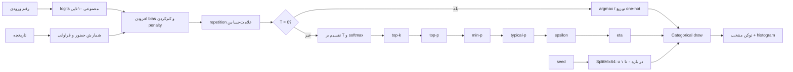

# آزمایشگاه پارامترهای Prompt و Decoding

این بخش برای پاسخ به یک سؤال ظاهراً ساده ساخته شده است: «وقتی `temperature` یا
`top_p` را عوض می‌کنم، دقیقاً کدام عدد در کدام مرحله تغییر می‌کند؟»

پاسخ کوتاه این است که همهٔ knobها هم‌جنس نیستند. برخی متن ورودی را عوض می‌کنند،
برخی امتیاز توکن را، برخی مجموعهٔ مجاز را، برخی فقط سقف طول و هزینه را و برخی
اصلاً کنترل نیستند و فقط telemetry می‌دهند.

## ۱. پنج صفحهٔ کنترل

| صفحهٔ کنترل | نمونه‌ها | ورودی مستقیم آن | چیزی که تغییر می‌دهد |
|---|---|---|---|
| Prompt | role، دستور، few-shot، delimiter | متن/پیام | context و در نتیجه logits مدل |
| Logit processing | bias، presence، frequency، repetition | logits + تاریخچه | امتیاز هر token ID |
| Sampling | temperature، top-k، top-p، min-p، typical، epsilon، eta، seed | توزیع گام بعد | شکل توزیع، support یا قرعه |
| Orchestration | candidates، reasoning effort، tool choice، RAG top-k | درخواست/میزبان | تعداد مسیر، compute، سند یا ابزار |
| Observation | logprobs، histogram، latency | خروجی اجرا | فقط آنچه می‌بینیم؛ نه خود رفتار |

نکتهٔ بنیادی: تغییر Prompt پیش از ساخته‌شدن logits اثر می‌گذارد؛ temperature
پس از logits. بنابراین نمی‌توان با بالا بردن temperature «اطلاعاتی را که در
context نبود» به مدل داد.

## ۲. مرز ادعای موتور ده‌رقمی

واژگان این موتور دقیقاً `0123456789` است. برای رقم ورودی `d`، یک بردار logit
کنترل‌شده می‌سازیم که قلهٔ آن `(d + 1) mod 10` باشد. این بردار خروجی checkpoint
نیست. به همین دلیل:

- می‌توان اثر sampling را بدون مخلوط‌شدن با کیفیت آموزش دید؛
- نمی‌توان نتیجه را accuracy یک LLM واقعی نامید؛
- انتخاب تصادفیِ رقمی غیر از قله «خرابی شبیه‌ساز» نیست؛ همان معنای sampling است.

فرمت پاسخ API برابر `sampling-lab-v1` و وضعیت آن
`algorithmic_simulation` است.

## ۳. فلوچارت اجرایی دقیق



ترتیب بالا قرارداد همین پروژه است. ترتیب processorها، scope تاریخچه، tie-break
و حتی تفسیر `temperature=0` میان APIها و کتابخانه‌ها می‌تواند فرق کند.

## ۴. از logit تا احتمال، پله‌به‌پله

### پلهٔ ۱: logit خام

`logit` یک امتیاز نامحدود است، نه درصد. Softmax آن را به احتمال تبدیل می‌کند:

```text
p_i = exp(z_i - max(z)) / Σ_j exp(z_j - max(z))
```

کم‌کردن `max(z)` برای پایداری عددی است و توزیع را عوض نمی‌کند.

### پلهٔ ۲: bias، presence و frequency

برای شمارش `c_i` از token `i`:

```text
z'_i = z_i + bias_i
             - presence_penalty × 1[c_i > 0]
             - frequency_penalty × c_i
```

- Presence فقط می‌پرسد «آمده یا نه؟»؛ یک‌بار و ده‌بار از دید آن یکسان است.
- Frequency تعداد را می‌بیند؛ تکرار سوم جریمهٔ بیشتری از تکرار اول می‌گیرد.
- مقدار منفی هر دو، تکرار را تشویق می‌کند.
- Logit bias روی token ID است؛ یک واژهٔ انسانی ممکن است چند token داشته باشد.

### پلهٔ ۳: repetition penalty

قرارداد رایج Hugging Face علامت logit را در نظر می‌گیرد:

```text
اگر token دیده شده و z < 0:  z ← z × r
اگر token دیده شده و z ≥ 0:  z ← z / r
```

`r=1` خنثی، `r>1` جریمه و `0<r<1` پاداش است. این روش جایگزین presence یا
frequency نیست.

### پلهٔ ۴: temperature

```text
p_i(T) = softmax(z_i / T)
```

- `0<T<1`: قله‌ها تیزتر و آنتروپی معمولاً کمتر؛
- `T=1`: بدون تغییر؛
- `T>1`: توزیع تخت‌تر و تنوع بالقوه بیشتر؛
- `T=0` در قرارداد صفحه: greedy `argmax`، نه تقسیم بر صفر.

دما رتبهٔ logits را تغییر نمی‌دهد، ولی جرم احتمال‌ها را تغییر می‌دهد؛ بنابراین
می‌تواند اندازهٔ مجموعه‌ای را که top-p نگه می‌دارد تغییر دهد.

### پلهٔ ۵: top-k

```text
S_k = k token با بزرگ‌ترین احتمال
```

تمام tokenهای بیرون `S_k` احتمال صفر می‌گیرند و باقی بازنرمال می‌شوند. در این
صفحه `k=0` یعنی خاموش. این `k` تعداد tokenهاست؛ در RAG، `k` تعداد سند یا chunk
است.

### پلهٔ ۶: top-p یا nucleus

```text
S_p = کوچک‌ترین پیشوند مرتب‌شده که Σ p_i ≥ p
```

بر خلاف top-k، تعداد اعضای آن ثابت نیست. اگر مدل مطمئن باشد شاید یک یا دو token
کافی باشد؛ در توزیع تخت tokenهای بیشتری لازم می‌شود.

### پلهٔ ۷: min-p

```text
token i می‌ماند اگر p_i ≥ min_p × max_j(p_j)
```

آستانه نسبی است. تعریف الگوریتم روشن است، ولی مقالهٔ بازتحلیل ۲۰۲۵ نشان می‌دهد
نباید برتری عمومی کیفیت/تنوع آن را قانون قطعی دانست.

### پلهٔ ۸: locally typical

ابتدا آنتروپی `H(p)` و surprise هر token یعنی `-log(p_i)` محاسبه می‌شود. سپس
tokenها بر اساس فاصلهٔ زیر مرتب می‌شوند:

```text
distance_i = | -log(p_i) - H(p) |
```

کوچک‌ترین مجموعه با جرم حداقل `typical_p` می‌ماند. این الگوریتم در پی نزدیک‌کردن
اطلاعات token منتخب به اطلاعات «معمول» همان گام است، نه کشف حقیقت.

### پلهٔ ۹: epsilon و eta

```text
epsilon: p_i ≥ ε
eta:     p_i ≥ min(η, sqrt(η) × exp(-H))
```

اولی کف مطلق و دومی کف سازگار با آنتروپی است. موتور همیشه بهترین token را نگه
می‌دارد تا candidate set خالی نشود.

### پلهٔ ۱۰: seed و قرعهٔ categorical

موتور محلی از `SplitMix64` یک عدد `u` در `[0,1)` می‌سازد و نخستین tokenی را
می‌گیرد که cumulative probability از `u` عبور کند. stream قرعهٔ اصلی از stream
histogram جداست؛ پس زیادکردن تعداد draw، پاسخ اصلی را عوض نمی‌کند.

در سرویس‌های واقعی seed معمولاً تکرارپذیری best-effort می‌دهد. تغییر نسخهٔ مدل،
backend، GPU یا پیاده‌سازی kernel می‌تواند نتیجه را عوض کند.

## ۵. مثال عددی preset «متعادل»

برای رقم `4`، تاریخچهٔ `11234` و تنظیم‌های
`T=0.8, top_k=5, top_p=0.9`:

| مرحله | تعداد بازمانده | آنتروپی (nat) | احتمال رقم‌های اصلی |
|---|---:|---:|---|
| منبع | ۱۰ | ۱٫۵۹۳ | `P(5)=0.480`, `P(6)=0.205`, `P(7)=0.113` |
| temperature | ۱۰ | ۱٫۳۳۴ | `P(5)=0.577`, `P(6)=0.199`, `P(7)=0.094` |
| top-k | ۵ | ۱٫۱۲۶ | `P(5)=0.606`, `P(6)=0.210`, `P(7)=0.099` |
| top-p | ۳ | ۰٫۸۵۱ | `P(5)=0.663`, `P(6)=0.229`, `P(7)=0.108` |

با seed پیش‌فرض، `u≈0.821539` است. cumulative رقم ۵ حدود `0.663` و با افزودن
رقم ۶ حدود `0.892` می‌شود؛ پس نمونهٔ منتخب ۶ است، با اینکه قله رقم ۵ بود.

## ۶. سه سطح خواندن رابط

### سطح ۱ — شهودی

- ارتفاع ستون = احتمال نهایی؛
- قاب نارنجی = پاسخ مورد انتظار منبع؛
- ستون سبز = قرعهٔ انتخاب‌شده؛
- ستون خاکستری = فیلترشده با احتمال صفر؛
- histogram = چند draw از همان snapshot، نه چند forward pass.

### سطح ۲ — فرآیندی

هر کارت مرحله یک snapshot کامل ده‌رقمی دارد. «خنثی» یعنی پارامتر در آن run
مقدار neutral داشته یا پس از greedy دیگر چیزی را حذف نکرده است. با انتخاب هر
مرحله، فرمول، توضیح و همان توزیع نمایش داده می‌شود.

### سطح ۳ — فرمولی

جدول، logit خام، logit پس از پنالتی و احتمال نهایی هر رقم را کنار هم می‌گذارد.
این سطح برای پاسخ به سؤال‌های دقیق مانند «رقم ۲ در کدام مرحله صفر شد؟» است.

## ۷. آزمایش‌های پیشنهادی

۱. **اثر خالص دما:** همهٔ فیلترها را خاموش کنید، seed را ثابت نگه دارید و T را
از `0.2` تا `1.8` sweep کنید. رتبه ثابت و entropy متغیر است.

۲. **Top-k در برابر top-p:** ابتدا فقط `top_k=3`، سپس فقط `top_p=0.7` را اجرا
کنید. اولی سه عضو ثابت و دومی تعداد پویا می‌دهد.

۳. **Presence در برابر frequency:** تاریخچه را `1112` بگذارید. با presence،
ارقام ۱ و ۲ جریمهٔ برابر؛ با frequency، رقم ۱ سه برابر رقم ۲ جریمه می‌شود.

۴. **Bias:** bias رقم ۰ را از `-5` تا `+5` حرکت دهید. raw logit ثابت می‌ماند و
تغییر نخست در مرحلهٔ additive دیده می‌شود.

۵. **Seed:** توزیع را ثابت نگه دارید و seed را عوض کنید. ستون‌های نظری ثابت و
قرعه/histogram متغیر می‌شوند.

۶. **Greedy:** `T=0` را بزنید. support یک می‌شود و تغییر seed بی‌اثر است.

۷. **ترکیب خطرناک:** preset «لبهٔ فیلترها» را اجرا کنید. چند فیلتر پشت‌سرهم
اثر همدیگر را می‌پوشانند؛ برای تنظیم واقعی بهتر است از یک baseline شروع و هر
بار یک knob را تغییر دهید.

## ۸. پارامترهای غیر-sampling

| کنترل | محل اثر | با چه چیزی اشتباه نشود؟ |
|---|---|---|
| `max_output_tokens` | سقف حلقهٔ تولید | دستور اختصار یا verbosity |
| `stop` | تطبیق suffix خروجی | پایان منطقی یا پاسخ کامل |
| `reasoning.effort` | compute policy وابسته به مدل | temperature یا نمایش chain-of-thought |
| `n` / self-consistency | تعداد مسیر کامل | top-k توکن |
| `tool_choice` | مجوز/اجبار میزبان | توانایی درون وزن مدل |
| retrieval `top_k` | تعداد سند/بردار | sampling `top_k` |
| chunk size/overlap | ساخت corpus/context | context window خود مدل |
| `logprobs` | مشاهدهٔ likelihood token | confidence حقیقت |

## ۹. معیارهای صحت این پیاده‌سازی

- هر stage دقیقاً ده token دارد؛
- احتمال‌های هر stage مجموع تقریباً یک دارند؛
- هیچ فیلتر معتبر candidate set را خالی نمی‌کند؛
- top-k دقیقاً k بازمانده دارد، مگر stage قبلی کمتر از k عضو داشته باشد؛
- top-p کوچک‌ترین prefix واجد آستانه را نگه می‌دارد؛
- seed و histogram deterministic محلی‌اند؛
- raw logits mutate نمی‌شوند؛
- request ناشناخته یا خارج بازه با HTTP 422 رد می‌شود؛
- رابط همیشه provenance مصنوعی بودن منبع را نشان می‌دهد.

منابع کامل و مرز ادعاها در `docs/fa/SOURCES.md` و `docs/fa/CLAIMS.md` ثبت
شده‌اند. نسخهٔ HTML همین راهنما از همهٔ آیکون‌های اطلاعات بخش ۰۸ باز می‌شود.
